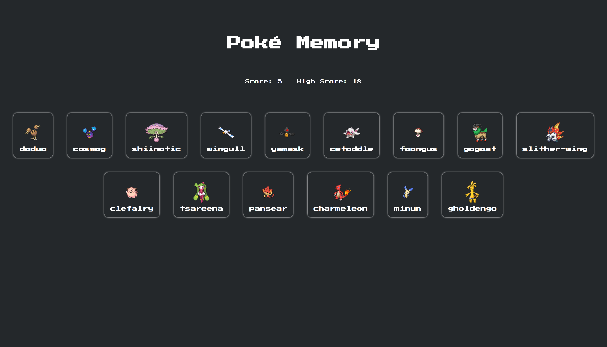

# Poké Memory

Memory card game based in pokémon created with React

## About the Game

This project is from [The Odin Project](https://www.theodinproject.com/lessons/node-path-react-new-memory-card) curriculum.

### How to Play

Get points by clicking on a pokémon but don't click on any more than once!

### Features

- It has three modes: easy, medium and hard 
- It has local storage to save the best storage
- It's support responsive design

### Tools and technology

- Visual Studio Code
- Linux Terminal
- Git and GitHub
- HTML and CSS
- JavaScript
- React
- Vite

## Screenshot

## Acknowledgements

- Project idea by [The Odin Project](https://www.theodinproject.com/)
- Web icon from [favicon.cc](https://www.favicon.cc/?action=icon&file_id=977940)
- Font family by CodeMan38 from [fontmirror](https://www.fontmirror.com/press-start-2p)

## Author

[Sergio García](https://github.com/sergiogarciiam)

## License

This project is open source and available under the [MIT License](./LICENSE).
